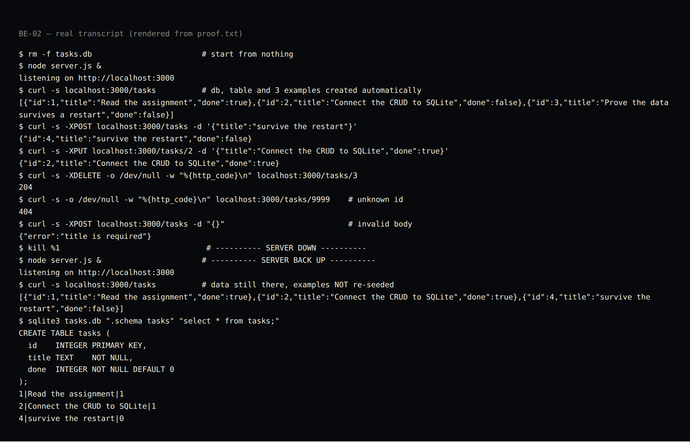

# BE-02 — Connecting your CRUD to the database

Assignment: *W3 · A1 — Connecting your CRUD to the database* (Backend AI Engineering, Week 3)
Author: Miguel Garcia Roman

Same API as the in-memory version, different storage. The client can't tell the
difference — until you restart the server and the data is still there.

```
Before:  Client -> API -> array in memory
Now:     Client -> API -> SQLite (tasks.db)
```

## The one decision

**No dependency.** The brief recommends `better-sqlite3`; Node 22+ ships
`node:sqlite` in the standard library, which is the same synchronous prepared-
statement API. So this is `npm install`-free: clone and run.

Everything else stayed boring on purpose: one file, prepared statements built once
at startup, no ORM, no migration tool. `id INTEGER PRIMARY KEY` is SQLite's rowid
alias, so autoincrement comes free.

## Run

```bash
node server.js          # creates tasks.db + the table on first run
node test.js            # self-check, 15 assertions, uses a throwaway db
```

Needs Node 22+ (`node:sqlite`). Tested on v24.13.0.

## API

| Method | Path | Does | Codes |
|--------|------|------|-------|
| `GET` | `/tasks` | list every task | 200 |
| `GET` | `/tasks/{id}` | one task | 200 · 404 |
| `POST` | `/tasks` | create, body `{"title": "...", "done": false}` | 201 · 400 |
| `PUT` | `/tasks/{id}` | replace title/done | 200 · 400 · 404 |
| `DELETE` | `/tasks/{id}` | remove | 204 · 404 |

Unknown id → `404 {"error": "Task not found"}`. Missing/blank title → `400`.

```bash
curl localhost:3000/tasks
curl -XPOST localhost:3000/tasks -H 'Content-Type: application/json' -d '{"title":"buy milk"}'
curl -XPUT localhost:3000/tasks/1 -H 'Content-Type: application/json' -d '{"title":"buy milk","done":true}'
curl -XDELETE localhost:3000/tasks/1
```

## Schema

```sql
CREATE TABLE tasks (
  id    INTEGER PRIMARY KEY,
  title TEXT    NOT NULL,
  done  INTEGER NOT NULL DEFAULT 0
);
```

SQLite has no boolean type, so `done` is stored as `0/1` and converted back to a
real JSON boolean on the way out. The API contract didn't change; only the storage
did — which is the whole point of the assignment.

The three example tasks are inserted **only when the table is empty**, so restarting
never duplicates them.

## Proof (real run, not a description)



Full transcript: [`proof.txt`](./proof.txt). It shows, in one uninterrupted run:

1. `rm -f tasks.db` → start from nothing.
2. First boot creates the file, the table and the 3 examples.
3. `POST` (id 4), `PUT` (id 2 → done), `DELETE` (id 3 → `204`).
4. `404` on an unknown id, `400` on a body with no title.
5. **Server killed, server restarted.**
6. `GET /tasks` still returns ids 1, 2, 4 — the edit persisted, the deletion
   persisted, and the examples were *not* re-seeded.
7. `.schema` + `SELECT *` straight from the file, so the rows are visible in the
   database and not just in the API's answers.

`test.js` covers the same ground automatically: seeding, every CRUD verb, both
error codes, and delete-twice → 404.

## Stage 4 — SQL by hand

Transcript: [`sql-by-hand.txt`](./sql-by-hand.txt). The server stays **running** the
whole time; I open `tasks.db` next to it and edit the rows directly.

```sql
UPDATE tasks SET done = 1;              -- mark every task completed
DELETE FROM tasks WHERE done = 1;       -- and then delete all completed ones
INSERT INTO tasks (title, done) VALUES ('added by hand in SQL', 0);
```

Then, with no restart and no sync step, the API answers with the hand-written row:

```
$ curl -s localhost:3000/tasks
[{"id":1,"title":"added by hand in SQL","done":false}]
```

**One sentence:** `UPDATE tasks SET done = 1;` returned nothing at all and still
changed every row — and the API served that change on the very next request,
because the shell and the server are not two copies of the data, they are two
programs opening the same file.

The full five-query set from the brief (`SELECT *`, `WHERE done = 1`, `COUNT(*)`,
`UPDATE`, `DELETE`) is in the transcript with its real output.

## Requirements checklist

- [x] Same CRUD endpoints as Assignment 1
- [x] Stored in SQLite instead of memory
- [x] Data survives server restarts *(step 5–6 above)*
- [x] Database created automatically if missing
- [x] `tasks` table created automatically if missing
- [x] Three examples inserted only on the first run
- [x] CRUD operations use SQL queries (prepared statements)
- [x] Unknown ids return 404, invalid requests return 400
- [x] Public repo with README and database screenshot

## Extras and stretch goals

| Extra | How | Where |
|-------|-----|-------|
| Search | `GET /tasks?search=milk` → `WHERE title LIKE ?` | SQL, not a JS loop |
| Filter | `GET /tasks?done=true` → `WHERE done = ?` | SQL |
| Sort | `GET /tasks?sort=title` → `ORDER BY title` | SQL |
| Stats | `GET /stats` → `COUNT(*) FILTER (WHERE done = 1)` | SQL |
| Index | `CREATE INDEX tasks_title ON tasks (title)` | on the column search/sort scan |
| Transaction | seeding wrapped in `BEGIN` / `COMMIT` / `ROLLBACK` | startup |

**What an index is for:** without one, `WHERE title LIKE ?` reads every row; the
index is a pre-sorted copy of that column so SQLite can jump instead of scan. On
three rows it changes nothing — on three million it's the whole ballgame.

**Why the transaction matters:** the three examples are one decision, not three.
If the second insert failed, a plain loop would leave a table with one row in it —
which is not empty, so the seed would never run again and the database would be
permanently half-built. `BEGIN`/`COMMIT` makes it all-or-nothing.

**The API didn't change:** `test.js` was written against the in-memory contract and
still passes untouched against SQLite (the only new assertions are for the extras
above). That's the proof storage is "just an implementation detail" — if swapping
the storage layer had leaked into the API, those assertions would be the first
thing to break.

**Skipped:** `created_at` / `updated_at`. Adding columns to a live table is exactly
the pain that migrations exist to manage, and this repo has no migration story yet;
it's a Week-N assignment, not a stealth one here.

## Note on `tasks.db`

The committed `tasks.db` is the exact file the transcript produced, kept as evidence.
Delete it and the server rebuilds it from scratch on the next boot.
